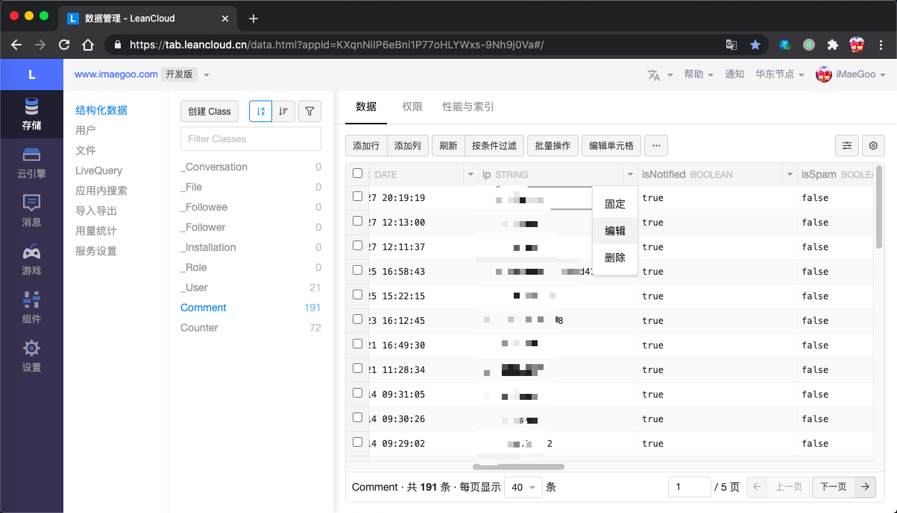
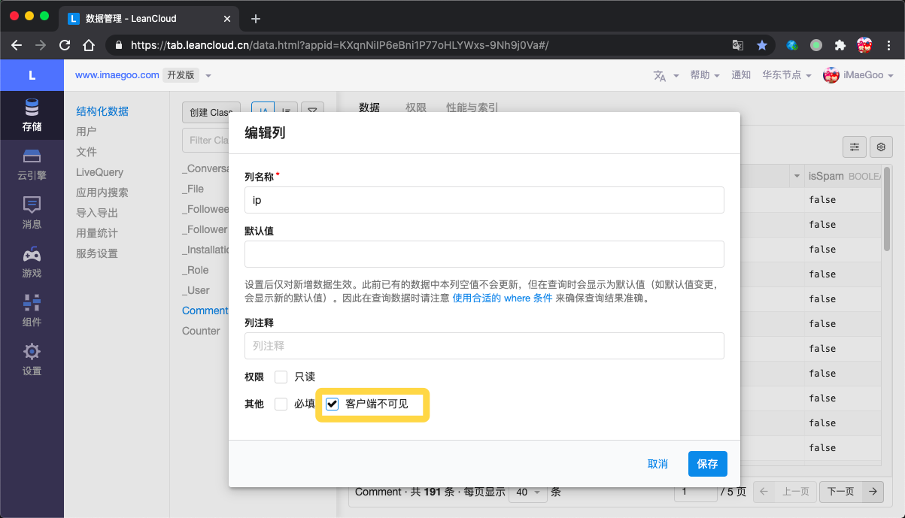
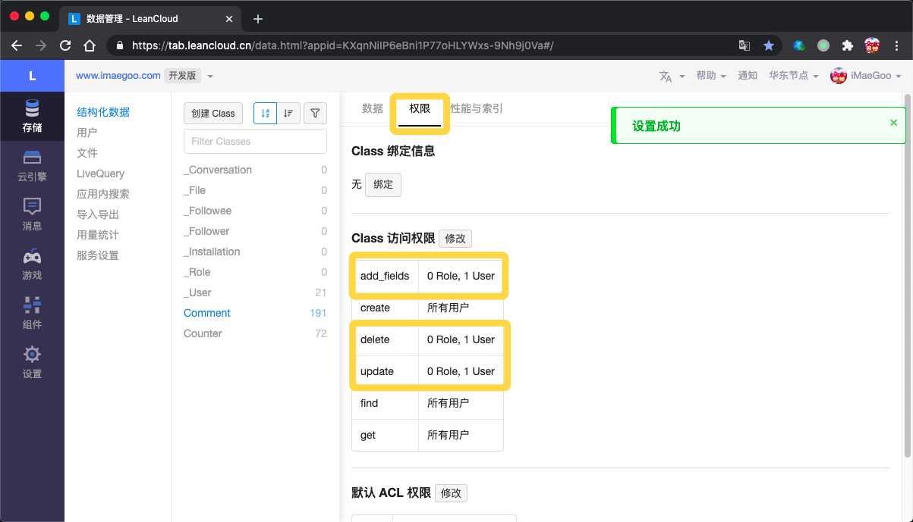
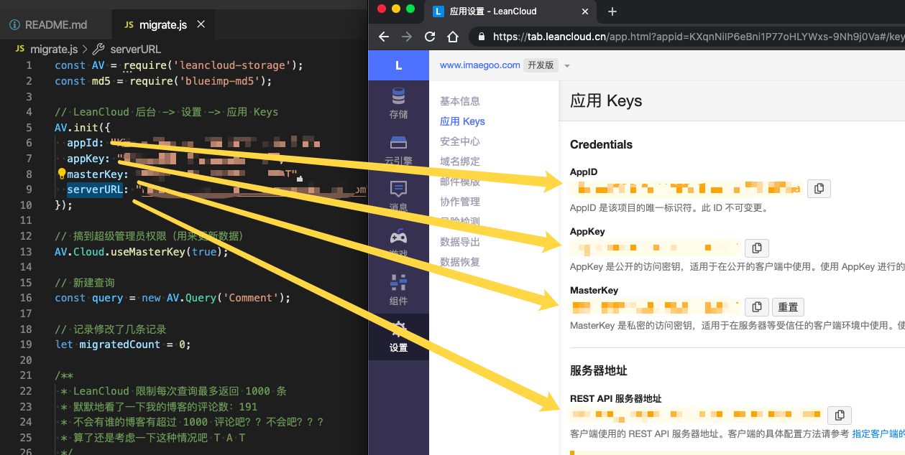
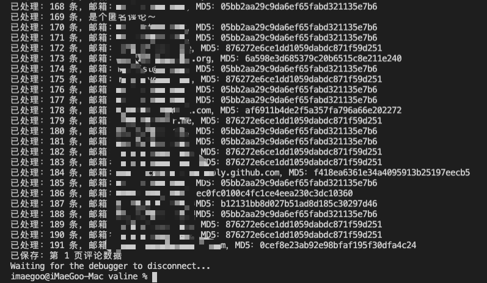

# Valine 魔改 隐私保护版

## Instruction

这是根据 [xCss/Valine#336](https://github.com/xCss/Valine/issues/336) 的需求实现的魔改版本，基于 Valine.min.js 版本 1.4.14 修改。

因 *发送请求中响应内容明文暴露评论者IP、邮箱等隐私内容*，博客主需要[手动更改字段权限](https://leancloud.cn/docs/data_security.html#hash723958571)，然而，如果设置 mail 客户端不可见，将不会显示评论者的 Gravatar，转为显示默认头像。

该魔改版新增一个可见字段（`mailMd5`）存储 mail 的 MD5，并提供了脚本处理现有评论数据。

## Usage

1. 访问 LeanCloud 控制台 > 存储 > 结构化数据
2. 选择 Comment Class，分别点击 mail 和 ip 相应字段的下拉菜单，选择编辑

3. 勾选"客户端不可见"后，客户端发起查询的时候，返回的结果将不包含这个字段<br>
\* 即使用 AppKey 指定字段名查询，也不会返回字段值，足够安全。

4. 请同样确认 class 的权限配置

5. 克隆本仓库
``` sh
# 克隆
git clone -b imaegoo/1.4.14 https://github.com/imaegoo/Valine.git valine
cd valine
# 安装依赖
npm install
```
6. 打开 `migrate.js`，修改里面的 appId，appKey，masterKey，serverURL 为自己的

7. 执行脚本
``` sh
node migrate.js
```
<br>
\* 如果提示 `Error: Cannot find module 'leancloud-storage'`，请先运行 `npm install`<br>
\* 如果提示 `Error: Too many requests. [429 POST ...]`，尝试重新运行，如果一直不解决，请提交 [issue](https://github.com/imaegoo/Valine/issues)

8. 替换博客的 `Valine.min.js` 为本仓库到 `valine.js`，可以使用 CDN 地址：<br>
https://cdn.jsdelivr.net/npm/@imaegoo/valine@1.4.1-4.1/valine.min.js
9. 测试一下，头像是否正常加载，API 是否没有返回 mail 和 ip

## Difference

如果你对魔改版感到不放心，可以[检查检查我都改了些啥](https://github.com/imaegoo/Valine/commit/87b56361a30fe2b806ebb56154559141ffca34cb)
